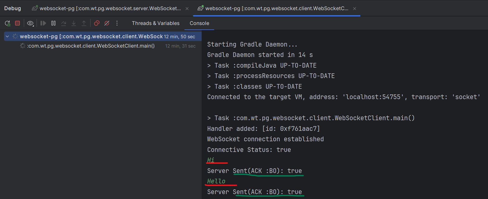
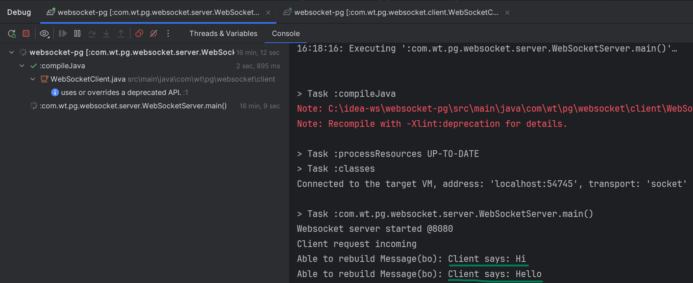

This example depicts WebSocket with BinaryWebSocketFrame payload.

* run `WebSocketServer.java` which open ws://localhost:8080/ws end point and listens to any incoming requests
    
  
      For simplicity it handles only BinaryWebSocketFrame and prints it's value and acknowledges with true

* Pojos used for serialization are `ACK.java` and `Message.java`(Client sends this POJO by applying Hessian Serialization) 

* run `WebSocketClient.java` which attempts to establish the connection to the server's end point
    
      
    Also spawns a thread to send messages through console

Below are screen shots

Console of `WebSocketClient.java`, the Red underline is the message(`Message.java`) we sent and the Green underline is the data sent by Server(`ACK.java`)


Console of `WebSocketServer.java`, As you can observe in the above screenshot from WebSocketClient.java's Console whatever is sent is received by Server and the same is seen in server console  

____
Browser detects the protocol ws and sends additional header to switch to websocket from regular http and 

Adds additional Request header[Refer the SS below]


The response for the upgradation is given below.
```
Connection: upgrade //Sending upgrade request initially with http
upgrade: websocket // indicated to which protocol
sec-websocket-accept: unique_identifier for new connection
```

Refer image: 

When Connect button is pressed the SS showing switch protocols and the http code for that is 101.

